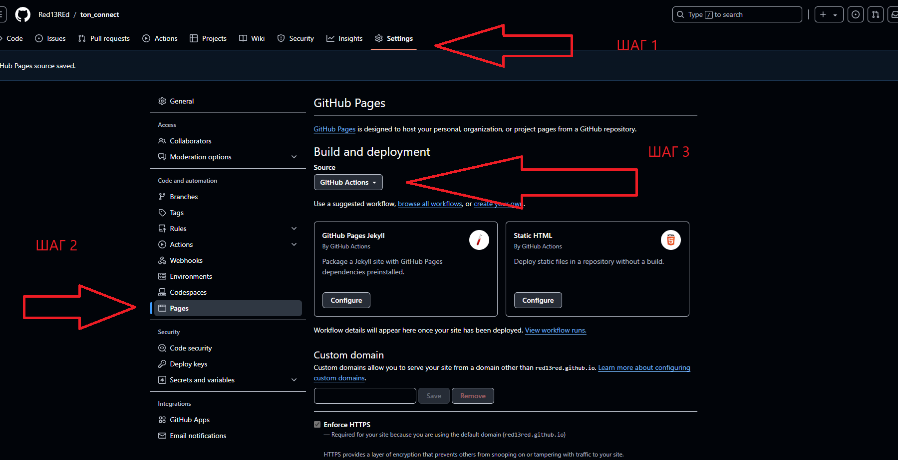
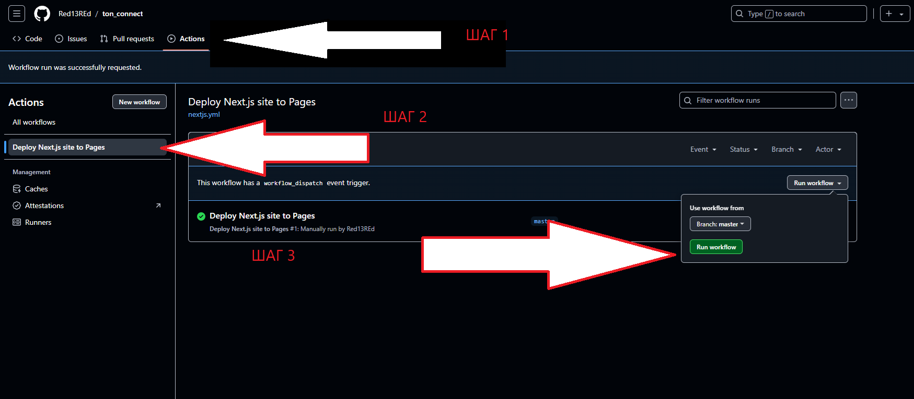

# Как развернуть 

1) ### Выложить проект на github.
2) ### Перейти в настройки проекта.
   1) Перейти в настройки проекта.
   2) Выбрать "Pages".
   3) В "Build and deploy" выбрать "GitHub Actions".

3) ### Перейти в "Actions".
   1) Перейти в "Actions".
   2) В левом меню Выбрать "Deploy Next.js site to Pages".
   3) Нажать на кнопку "Run workflow".

# Как Пополнить кошелек 
   1) ### Создать кошелек для "testnet", если его нет.
   2) ### Перейти в бот https://t.me/testgiver_ton_bot;
      1) Ввести кошелек.
      2) Победить капчу :).
   3) ### Дождаться получения 2 ton.